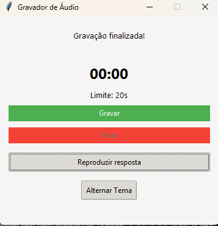

# Conversando por Voz Com o ChatGPT Utilizando Whisper (OpenAI) e Python

Este projeto cria uma interface gráfica que permite ao usuário gravar um prompt(clicando no botão gravar) que será respondido pelo chatGPT, sendo a resposta transcrita em áudio. Para ouvi-la basta clicar no botão "Reproduzir resposta", que abrirá o áudio da resposta, em mp3, no reprodutor padrão de mp3 do sistema.
A resposta fica armazenada na pasta audios/resposta.mp3.



Foi utilizado a API do Whisper da OpenAI para transcrever o áudio do usuário e o gTTS (Google Text-to-Speech) para transformar a resposta em texto retornada pela API do chatGPT em áudio.

# Uso

- Baixe o repositório para o seu ambiente via terminal:

```
git clone https://github.com/ntorresamendola/Bradesco-GenAi-e-dados-convernsando-com-ai.git
```

- Requerimentos:

sounddevice
numpy
openai
gTTS

- Instalar os requerimentos(depois de ter baixado o repositório):

```
pip install -r requirements.txt
```

Ir, via terminal, até a pasta onde repositório foi baixado e executar:

```
python3 main.py
```

#Estrutura de arquivos

├── images/
│   └── interface.png
├── .env.example
├── .gitignore
├── gravador_audio.py
├── main.py
├── README.md
├── requeriments.txt
├── resposta_chatgpt.py
├── resposta_para_audio.py
└── transcreve_audio.py

